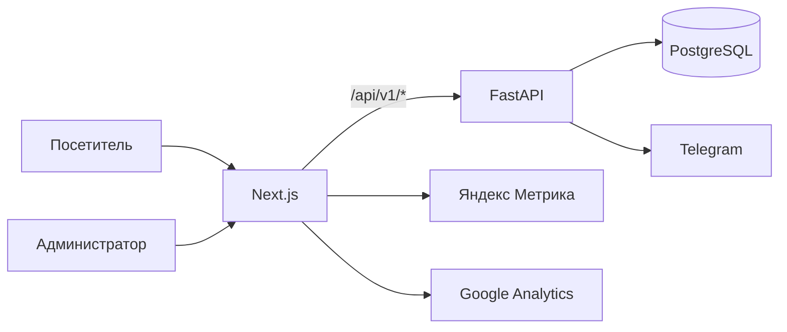

<p align="center">
  
</p>

<h1 align="center">Ardashev.dev</h1>

<p align="center">
  Персональный сайт Александра Ардашева о разработке Telegram-ботов, Max-ботов, парсеров и CRM-интеграций.
</p>

<p align="center">
  <a href="https://ardashev.dev">Открыть сайт</a>
  &nbsp;·&nbsp;
  <a href="https://t.me/aardashevdev">Telegram</a>
  &nbsp;·&nbsp;
  <a href="mailto:aardashev.dev@gmail.com">Email</a>
</p>

<p align="center">
  
  
  
  
  
  <a href="LICENSE"></a>
</p>

## О проекте

Сайт знакомит с услугами, показывает реальные кейсы и помогает быстро обсудить задачу. В репозитории находятся публичная часть на Next.js, API для заявок и собственной аналитики, закрытая административная страница и конфигурация для запуска на сервере.

Основные разделы:

- страницы услуг по Telegram, Max, парсингу и CRM;
- кейсы с описанием задачи, реализации и результата;
- статьи о подготовке и оценке разработки ботов;
- форма заявки с сохранением данных и уведомлением в Telegram;
- собственный учёт посещений вместе с Яндекс Метрикой и Google Analytics;
- техническая SEO-разметка для Google и Яндекса.

## Как устроен проект



Публичный браузер обращается к API через тот же домен. Next.js проксирует `/api/v1/*` на FastAPI, который слушает локальный адрес `127.0.0.1:8000`. Отдельный публичный поддомен для API не требуется.

## Стек

| Часть | Технологии |
|---|---|
| Интерфейс | Next.js 15, React 19, TypeScript, Tailwind CSS |
| API | FastAPI, Pydantic, SQLAlchemy, Uvicorn |
| Данные | PostgreSQL 16, asyncpg |
| Авторизация | JWT, отдельный пароль администратора |
| Аналитика | Яндекс Метрика, Google Analytics 4, собственные page views |
| Развёртывание | systemd, PM2 или другой процесс-менеджер, Nginx |

## Структура репозитория

```text
automation-portfolio/
├── frontend/              # сайт, SEO, аналитика и административная страница
│   ├── app/               # маршруты Next.js App Router
│   ├── components/        # интерфейс и клиентская логика
│   ├── data/              # кейсы, статьи и данные сайта
│   ├── lib/               # API-клиент и серверные helpers
│   └── public/            # изображения, видео и robots.txt
├── backend/               # FastAPI-приложение
│   └── app/
│       ├── api/           # маршруты авторизации, заявок и аналитики
│       ├── core/          # настройки, база данных и безопасность
│       ├── models/        # модели SQLAlchemy
│       ├── repositories/  # доступ к данным
│       ├── schemas/       # модели запросов и ответов
│       └── services/      # бизнес-логика
├── deploy/                # systemd и инструкция для production
└── docker-compose.yml     # локальный PostgreSQL
```

## Локальный запуск

Понадобятся Node.js 20+, npm, Python 3.11+ и Docker с Docker Compose.

### 1. Настройка окружения

Создайте рабочие env-файлы из примеров:

```bash
cp backend/.env.example backend/.env
cp frontend/.env.example frontend/.env.local
```

В PowerShell те же команды выглядят так:

```powershell
Copy-Item backend/.env.example backend/.env
Copy-Item frontend/.env.example frontend/.env.local
```

Для локальной разработки значения по умолчанию подходят почти полностью. Обязательно замените `ADMIN_PASSWORD` и `JWT_SECRET_KEY`, если окружение доступно кому-то кроме вас.

### 2. PostgreSQL

```bash
docker compose up -d db
```

Контейнер создаст базу `portfolio_db` на порту `5432`. Таблицы приложения появятся автоматически при запуске FastAPI.

### 3. Backend

```bash
cd backend
python -m venv .venv
```

Linux и macOS:

```bash
source .venv/bin/activate
pip install -r requirements.txt
uvicorn app.main:app --reload --host 127.0.0.1 --port 8000
```

Windows PowerShell:

```powershell
.venv\Scripts\Activate.ps1
pip install -r requirements.txt
uvicorn app.main:app --reload --host 127.0.0.1 --port 8000
```

Проверка API:

```bash
curl http://127.0.0.1:8000/health
```

Ожидаемый ответ: `{"status":"ok"}`.

### 4. Frontend

В отдельном терминале:

```bash
cd frontend
npm install
npm run dev
```

Сайт откроется на [http://localhost:3000](http://localhost:3000). API-документация FastAPI доступна на [http://127.0.0.1:8000/docs](http://127.0.0.1:8000/docs).

## Переменные окружения

Актуальный набор переменных хранится в [`backend/.env.example`](backend/.env.example) и [`frontend/.env.example`](frontend/.env.example).

| Переменная | Где используется | Назначение |
|---|---|---|
| `DATABASE_URL` | backend | Подключение к PostgreSQL через asyncpg |
| `TELEGRAM_BOT_TOKEN` | backend | Токен бота для уведомлений о заявках |
| `TELEGRAM_CHAT_ID` | backend | Чат, куда отправляются уведомления |
| `ADMIN_PASSWORD` | backend | Вход в закрытую административную страницу |
| `JWT_SECRET_KEY` | backend | Подпись JWT-токенов |
| `CORS_ORIGINS` | backend | Разрешённые источники запросов |
| `BACKEND_API_URL` | frontend, server | Внутренний адрес FastAPI для proxy-маршрутов |
| `NEXT_PUBLIC_API_URL` | frontend, browser | Публичная база API; обычно оставляется пустой для same-origin |
| `NEXT_PUBLIC_GA_MEASUREMENT_ID` | frontend | Шаблон переменной для GA4; текущий ID задаётся в `app/layout.tsx` |

Не добавляйте рабочие `.env` в Git. Для production используйте длинные случайные значения `ADMIN_PASSWORD` и `JWT_SECRET_KEY`.

## SEO и аналитика

В проекте уже настроены:

- уникальные title, description, canonical, Open Graph и Twitter Cards;
- JSON-LD для услуг, организации, статей, FAQ и хлебных крошек;
- `sitemap.xml` с датами обновления;
- отдельные правила `robots.txt` для Google и Яндекса;
- Яндекс Метрика с целями и отслеживанием переходов;
- Google Analytics 4;
- серверный учёт обезличенных page views;
- административная сводка по посещениям.

Страницы `/admin` и `/sitemap` закрыты от индексации. Публичные страницы отдаются с серверной SEO-разметкой, поэтому поисковым роботам не нужно выполнять JavaScript, чтобы увидеть основные данные.

## Production-сборка

Frontend:

```bash
cd frontend
npm ci
npm run build
npm run start
```

Backend запускается через Uvicorn за Nginx. Готовый unit-файл находится в [`deploy/automation-portfolio-api.service.example`](deploy/automation-portfolio-api.service.example), а подробный порядок настройки описан в [`deploy/analytics-production.md`](deploy/analytics-production.md).

После обновления проверьте:

```bash
curl --fail https://ardashev.dev/api/health
curl -I https://ardashev.dev/robots.txt
curl -I https://ardashev.dev/sitemap.xml
```

## Полезные команды

```bash
# production-сборка frontend
cd frontend && npm run build

# просмотр логов FastAPI
journalctl -u automation-portfolio-api -n 100 --no-pager

# остановка локальной базы
docker compose down
```

## Контакты

- Сайт: [ardashev.dev](https://ardashev.dev)
- Telegram: [@aardashevdev](https://t.me/aardashevdev)
- Email: [aardashev.dev@gmail.com](mailto:aardashev.dev@gmail.com)

## Лицензия

Проект распространяется по лицензии [MIT](LICENSE). Вы можете использовать, изменять и распространять код при сохранении уведомления об авторских правах и текста лицензии.
